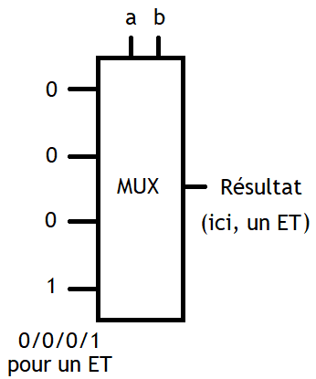

# Le binaire

Auteur : Franck CHAMBON

## I - Vocabulaire

### *Bit*

!!! info inline end "Le *bit*"
    L'informatique fonctionne avec **deux** états fondamentaux :

    - fermé  ou `0`, pas de signal
    - ouvert ou `1`, du signal
    
    **binaire** est l'adjectif pour deux états.


    |Nb états| Adjectif |
    |--------|----------|
    | 2  | Binaire      |
    | 3  | Ternaire     |
    | 8  | Octal        |
    | 10 | Décimal      |
    | 16 | Hexadécimal  |

    ---

    Le fonctionnement d'un ordinateur repose sur des
     circuits de calcul logique et bit à bit.[^1]
    

    [^1]: [Le fonctionnement d'un ordinateur repose sur des
     circuits de calcul logique et bit à bit](https://fr.wikibooks.org/wiki/Fonctionnement_d%27un_ordinateur/Les_circuits_de_calcul_logique_et_bit_%C3%A0_bit?uselang=fr)

L'unité élémentaire de stockage informatique
    au niveau le plus bas est le *bit* (_**Bi**nary digi**t**_).

- Un disque dur contient des milliers de milliards de bits,
- la mémoire vive contient des milliards de bits,
- un processeur moderne d'architecture[^2] `ARMv8` ou `AMD64`,
    contient de la mémoire cache avec des millions de bits et
    des registres de 64 bits.

[^2]: Quelques types d'architecture modernes :

    - L'architecture de processeur [ARMv8](https://fr.wikipedia.org/wiki/ARMv8)
    - L'architecture de processeur [AMD64](https://fr.wikipedia.org/wiki/AMD64)

Bref, l'information est constituée de cases remplies soit de `0`, soit de `1`.

!!! danger "Propriété mathématique"
    Avec un paquet de $n$ cases binaires, on peut coder $2^n$ symboles différents.

    !!! example "Avec 3 cases binaires"
        On peut coder $2^3 = 8$ symboles différents.

        - `000` pour 0
        - `001` pour 1
        - `010` pour 2
        - `011` pour 3
        - `100` pour 4
        - `101` pour 5
        - `110` pour 6
        - `111` pour 7

    !!! example "Avec 8 cases binaires"
        On peut coder $2^8 = 256$ symboles différents.

        Pour un lot de 8 bits, on parle d'**octet** (*byte*).

!!! info "Remarques"
    - *bit* est abrégé en $\text{b}$, comme dans un débit Internet
     à $24~\text{Mbps}$ (24 mégabits par seconde).
    - *byte* (prononcé « baïte ») est abrégé en $\text{B}$,
     le débit précédent correspond à $3~\text{MBps}$ (*3 megabytes per second*).
    - octet est abrégé en $\text{o}$,
     comme dans $3~\text{Mo}/\text{s}$, (3 mégaoctets par seconde).

### Octet

!!! info inline end "Codage ASCII"
    | Caractère | Code ASCII |
    |:---------:|:----------:|
    | `0` | `00110000` |
    | `1` | `00110001` |
    | `9` | `00111001` |
    | `A` | `01000001` |
    | `B` | `01000010` |
    | `Z` | `01011010` |
    | `a` | `01100001` |
    | `b` | `01100010` |
    | `z` | `01111010` |
    | `.` | `00101110` |
    | `^` | `01011110` |
    | `(` | `00101000` |

En pratique les données informatiques transitent
 très souvent par paquets de 8 bits, donc par octets.

La première raison à cela a été l'utilisation de l'ASCII
 pour transporter l'information du texte écrit.

Le codage ASCII[^3]
    utilise un octet :

- Le premier bit est à 0 ;
- les 7 autres sont variables, donc $2^7 = 128$ symboles différents.

[^3]: [Le codage ASCII](https://fr.wikipedia.org/wiki/American_Standard_Code_for_Information_Interchange)

Il est utilisé pour coder :

- le caractère espace,
- les chiffres arabes,
- les lettres latines majuscules et minuscules sans accent,
- des symboles de ponctuation,
- des opérateurs mathématiques
- et quelques autres symboles techniques.

!!! warning "Limitations"
    ASCII ne peut pas coder tous les caractères.

    - Il existe trop de langues et donc énormément de lettres,
        un choix a été fait ; certaines lettres latines, les plus utilisées.
    - Pour la ponctuation, un choix a aussi été fait.
    
    Pour un texte en anglais, avec une ponctuation classique,
        l'ASCII est parfaitement adapté.

??? danger "ASCII étendu"
    À une époque, dans certains pays, on utilisait
     une variante de l'ASCII étendu (un pour chaque pays),
     avec 128 symboles supplémentaires (ceux avec le bit de poids fort égal à 1).
    
    Le problème était pour la communication entre utilisateurs
     de différents pays ; c'était parfois compliqué...
     En France on utilisait l'encodage
     `latin-1` nommé aussi `ISO 8859-1`[^4].

[^4]: [L'encodage `latin-1`, ou `ISO 8859-1`](https://fr.wikipedia.org/wiki/ISO/CEI_8859-1)

{{ basthon('scripts/convertisseur.py', 700) }}

Avec le script ci-dessus, vous pouvez convertir un message texte ASCII vers du binaire.

Un message peut alors être transmis par une communication électronique.

:boom: **Défi** : Sauriez-vous faire un script `binaire_vers_ascii` ? :boom:

!!! done "UTF-8"
    Aujourd'hui on utilise souvent un codage UTF-8 [^5]
     avec un nombre variable d'octets pour pouvoir
     échanger du texte dans n’importe quelle langue, avec *smiley*...

    - Si le bit de poids fort est à `0`, alors le caractère est codé en ASCII ;
     le cas le plus fréquent.
    - Sinon, et c'est rare, il est codé sur plusieurs octets,
     et on peut utiliser au choix, tous les caractères
     que l'humanité est capable d'inventer :
     lettre de toute langue, hiéroglyphe, smiley, symbole technique, ...

[^5]: [Le codage UTF8](https://fr.wikipedia.org/wiki/UTF-8)

!!! cite "Pour simplifier, un caractère pèse un octet"
    Le poids d'un fichier texte est donné par la règle simplifiée :

    - Pour un texte très simple, un caractère pèse un octet.
    - Pour un texte plus technique, seuls les caractères hors ASCII sont
     codés sur plusieurs octets, et le poids en octets est supérieur
      au nombre de caractères. **Souvent juste un peu plus.**

    Exemple
    : Un livre simple en anglais d'un million de
     caractères pèse un méga-octet ($1~\text{Mo}$).

!!! tip "Niveaux de gris"
    [{align=right width=400}](https://commons.wikimedia.org/wiki/File:Nine_steps_stair_in_Lysekil_-_bw.jpg#/media/File:Nine_steps_stair_in_Lysekil_-_bw.jpg)

    Une autre utilisation de l'octet est de proposer 256 symboles différents,
     comme 256 nombres différents.
     **Un octet peut représenter un niveau de gris parmi 256.**

    Une image simple (en 256 niveaux de gris) est une liste de lignes,
     où chaque ligne est une liste de pixels codés sur **un** octet.
    
    Par exemple
    :   Dans le cas d'une image de 640 pixels de large, par 426 pixels de haut,
         hors compression, le poids est de $640×426×1 \approx 270~\text{ko}$.

Pour coder d'autres nombres, pour des images plus précises,
 ou pour d'autres usages, on pourra utiliser plus que 8 bits.

## II - Codage des entiers non signés

### Sur 4 bits

!!! tip "À connaître"
    On a $2^4 = 16$ nombres de $0$ à $15$.

    | $n$ | binaire | hexadécimal |
    |:---:|---------|:-----------:|
    |$0$|`0000`|`0`|
    |$1$|`0001`|`1`|
    |$2$|`0010`|`2`|
    |$3$|`0011`|`3`|
    |$4$|`0100`|`4`|
    |$5$|`0101`|`5`|
    |$6$|`0110`|`6`|
    |$7$|`0111`|`7`|
    |$8$|`1000`|`8`|
    |$9$|`1001`|`9`|
    |$10$|`1010`|`A`|
    |$11$|`1011`|`B`|
    |$12$|`1100`|`C`|
    |$13$|`1101`|`D`|
    |$14$|`1110`|`E`|
    |$15$|`1111`|`F`|

    Ce tableau est à connaître et à savoir refaire !

    Il est très utile.

### Sur 8 bits (1 octet)

!!! tip "À connaître"
    Il y a $2^8 = 256$ nombres de $0$ à $255$.

    Par exemple :

    | $n$ | binaire | hexadécimal |
    |:---:|---------|:-----------:|
    | $0$   |`0000 0000`|`0`|
    | $255$ |`1111 1111`|`FF`|
    | $15$  |`0000 1111`|`0F`|

    On note aussi :

    - $0 = (0000\,0000)_2$
    - $255 = (1111\,1111)_2$
    - $15 = (0000\,1111)_2$

On apprendra à faire les conversions, du binaire vers le décimal.

### Sur 32 bits (4 octets)

Il y a $2^{32} = 4\,294\,967\,296$ nombres de $0$ jusqu'à $4\,294\,967\,295$.

!!! tip "À connaître"
    On retiendra que sur 4 octets, on peut différencier plus de 4 milliards de nombres.

### Sur 64 bits (8 octets)

Il y a $2^{64} = 18\,446\,744\,073\,709\,551\,616$ nombres de $0$ jusqu'à $18\,446\,744\,073\,709\,551\,615$.

!!! tip "À connaître"
    On retiendra que sur 8 octets, on peut différencier plus de 18 milliards de milliards de nombres.

## III - Opérations en binaire

### Conversion du décimal vers le binaire

#### Première technique

1. On divise le nombre par deux jusqu'à obtenir un quotient égal à zéro.
2. On lit les restes dans l'ordre inverse.

!!! example "Exemple : avec $53$"
    !!! info inline end "Lecture du résultat"
        Penser à lire du bas vers le haut.

    $$
    \begin{array}{rcl}
    53/2 = 26 & \text{et il reste} & 1\\
    26/2 = 13 & \text{et il reste} & 0\\
    13/2 = 6  & \text{et il reste} & 1\\
    6/2 = 3   & \text{et il reste} & 0\\
    3/2 = 1   & \text{et il reste} & 1\\
    1/2 = 0   & \text{et il reste} & 1\\
    \end{array}
    $$

    Le résultat est $53 = (11\,0101)_2$.

    On préférera compléter à gauche avec deux zéros pour faire des paquets de quatre bits.
    
    $53 = (0011\,0101)_2$

!!! note "Exercice"
    Donner la représentation binaire de $42$.

    ??? done "Solution"
        !!! info inline end "Lecture du résultat"
            Penser à lire du bas vers le haut.

        $$
        \begin{array}{rcl}
        42/2 = 21 & \text{et il reste} & 0\\
        21/2 = 10 & \text{et il reste} & 1\\
        10/2 = 5 & \text{et il reste} & 0\\
        5/2 = 2 & \text{et il reste} & 1\\
        2/2 = 1 & \text{et il reste} & 0\\
        1/2 = 0 & \text{et il reste} & 1\\
        \end{array}
        $$

        Le résultat est $42 = (10\,1010)_2$.

        On préférera compléter à gauche avec deux zéros pour faire des paquets de quatre bits.
        
        $42 = (0010\,1010)_2$

#### Deuxième technique

1. On cherche à écrire le nombre comme une somme de puissance de deux, la plus grande possible.
2. Les puissances obtenues donnent des `1` à l'écriture binaire,
 les puissances absentes donnent des `0` à l'écriture.

!!! example "Exemple : avec $53$"
    - $53 = 32 + 21$
    - $53 = 32 + 16 + 5$
    - $53 = 32 + 16 + 4 + 1$
    
    Il n'y a pas de $8$, ni de $2$
    
    - $53 = 1×32 + 1×16 + 0×8 + 1×4 + 0×2 + 1×1$
    - $53 = (11\,0101)_2$

!!! note "Exercice"
    Donner la représentation binaire de $42$.

    ??? done "Solution"
        - $42 = 32 + 10$
        - $42 = 32 + 8 + 2$
        
        Il n'y a pas de $16$, ni de $4$, ni de $1$
        
        - $42 = 1×32 + 0×16 + 1×8 + 0×4 + 1×2 + 0×1$
        - $42 = (10\,1010)_2$

!!! note "Exercice"
    1. Vérifier que $203 = (1100\,1011)_2$
    2. Vérifier que $204 = (1100\,1100)_2$
    3. Comment peut-on déduire l'écriture de $205$, de $206$ ?

### Ajouter 1, à une écriture binaire

!!! tip "Un algorithme"
    - On va faire une boucle sur les chiffres lus,
        - soit on lit `1`,
        - soit on lit `0`,
        - soit on sort dans le vide...

    1. On part du chiffre le plus à droite.
    2. Tant que le chiffre lu est égal à `1`,
        + on le change en `0`,
        + on se décale à gauche.
    3. Si on arrive dans le vide,
        + alors on écrit `1`.
        + sinon on change le `0` en `1`.

### Conversion binaire vers décimal

Chaque chiffre binaire correspond à une puissance de deux.

- `1` : la puissance est présente, elle compte $1$ fois.
- `0` : la puissance est absente, elle compte $0$ fois.

On lit les chiffres de la droite vers la gauche,
 cela donne les puissances de $2$ : $2^0 = 1$, puis $2^1 = 2$, puis $2^2 = 4$, etc.

!!! example "Exemple"
    On lit bien les chiffres de la **droite vers la gauche** !

    - $(1100\,1011)_2 = 1×1 + 1×2 + 0×4 + 1×8 + 0×16 + 0×32 + 1×64 + 1×128$
    - $(1100\,1011)_2 = 1×1 + 1×2 + 1×8 + 64 + 128$
    - $(1100\,1011)_2 = 203$

### Addition d’entiers non signés

!!! tip "Méthode"
    - On rappelle que $2 = (10)_2$, $3 = (11)_2$.
    - Il suffit de poser l’addition comme en primaire, avec les retenues.

!!! example "Exemple : avec $5+7 = 12$"
    - $5 = (101)_2$
    - $7 = (111)_2$
    - $12 = (1100)_2$

    ```
    retenues :  1 1 1
    -----------
                  1 0 1
                + 1 1 1
                -------
                1 1 0 0
    ```

!!! note "Exercice"
    1. Vérifier en binaire que $179+75=254$.
    2. Vérifier en binaire que $13+13+13+13 = 13×4 = 52$.

### Multiplication d’entiers non signés

!!! tip "Méthode"
    On pose la multiplication comme en primaire.

!!! example "Exemple : avec $13×11=143$"
    - $13 = (1101)_2$
    - $11 = (1011)_2$
    - $143 = (1000\,1111)_2$

    ```
    retenues :  1 1 1 1 0 0 0
    -----------
                        1 1 0 1
                      × 1 0 1 1
                      ---------
                        1 1 0 1
                      1 1 0 1 .
                          0 . .
                  1 1 0 1 . . .
                  =============
                1 0 0 0 1 1 1 1
    ```

## IV - Conteneurs standards pour les entiers

!!! info "Sur 8 bits (1 octet)"
    On a $2^8=256$ possibilités. Deux conteneurs classiques existent.

    - Entiers non signés : de $0$ à $255$.
    - Entiers signés : de $-128$ à $+127$.

    Pour les entiers signés on partage l'intervalle en deux,
    zéro étant à la fois positif et négatif, il reste une place,
    on choisit d'avoir un négatif de plus. Nous y reviendrons.

!!! info "Sur 32 bits (4 octets)"
    On a $2^{32} \simeq 4$ milliards de possibilités.

    - Entiers non signés : de $0$ à $2^{32} -1$.
    - Entiers signés : de $-2^{31}$ à $+2^{31}-1$.

!!! info "Sur 64 bits (8 octets)"
    On a $2^{64} \simeq 18$ milliards de milliards de possibilités.

    - Entiers non signés : de $0$ à $2^{64} -1$.
    - Entiers signés : de $-2^{63}$ à $+2^{63}-1$.

## V - Codage des entiers signés

!!! fail "La mauvaise méthode : un bit de signe"
    1. On garde le bit de poids fort pour indiquer le signe.
    2. Les autres bits indiquent la valeur numérique.

    Il y a deux problèmes :

    - Il y aurait deux représentations pour l'entier $0$ : $+0$ et $-0$.
    - Les méthodes pour faire les opérations arithmétiques seraient complexes à programmer.

!!! done "La bonne méthode : le complément à deux"

    **La bonne nouvelle.**

    Cette méthode résout les deux problèmes précédents :

    - Il n'y a qu'une représentation pour $0$.
    - Les circuits intégrés pour faire les opérations
    entre nombres signés et non signés **sont exactement les mêmes**.

### Complément à deux

!!! tip "Aperçu de la méthode"
    On voudrait $(+1) + (-1) = 0$

    Sur un conteneur 8-bit, on prépare l'addition à trou,
    et on déduit que $(-1)$ se code avec `1111 1111`.

    Opération à trou :

    ```
      0 0 0 0   0 0 0 1
    + ? ? ? ?   ? ? ? ?
    ------------------
      0 0 0 0   0 0 0 0
    ```

    Solution :

    ```
      0 0 0 0   0 0 0 1
    + 1 1 1 1   1 1 1 1
    ------------------
    1 0 0 0 0   0 0 0 0
    ```

    :warning: On remarque qu'il reste un bit de poids fort,
    mais il n'est plus dans le conteneur 8-bit ;
    il est perdu, et on obtient bien 0 !

!!! info "_Overflow_, le débordement"
    Dans ce genre de situation, quand le résultat d'une opération déborde de la capacité du conteneur, on parle de débordement ou d'_overflow_. Non maîtrisé, c'est une source d'erreur. Python utilise des conteneurs à taille variable pour les entiers, donc il n'y a pas d'erreur de débordement, comme il y en a avec d'autres langages.

!!! faq "On souhaite aussi $(+6) + (-6) = 0$"
    Compléter cette addition binaire à trou :
    ```
      0 0 0 0   0 1 1 0
    + ? ? ? ?   ? ? ? ?
    ------------------
      0 0 0 0   0 0 0 0
    ```

    ??? done "Solution"
        ```
          0 0 0 0   0 1 1 0
        + 1 1 1 1   1 0 1 0
        ------------------
        1 0 0 0 0   0 0 0 0
        ```

!!! tip "Obtenir plus rapidement l'opposé d'un entier"
    On utilise le **complément à deux**.

    1. On part de l'écriture binaire de la partie numérique.
    2. On inverse tous les bits $0↔1$.
    3. On ajoute $1$.

    !!! example "Exemple : avec $6=(0000\,0110)_2$"
        - L'inversion donne `1111 1001`
        - L'ajout de $1$ donne `1111 1010`

!!! note "Exercices"
    1. Quel est le complément à 2 sur 8 bits de $-105$ ?
    2. Quel est l'entier représenté en complément à deux sur 8 bits par `1100 1001` ?
    3. Quel est l'entier représenté en complément à deux sur 8 bits par `0000 1101` ?

    ??? done "Solution"
        1. On applique la méthode
            - $105 = (0110\,1001)_2$
            - L'inversion donne `1001 0110`.
            - L'ajout de $1$ donne `1001 0111`.
            - La réponse est `1001 0111`.

        2. On teste d'abord si le nombre est positif ou négatif.
            - Le bit de poids fort est à `1`, donc ce nombre est négatif ; on applique la méthode.
            - L'inversion donne `0011 0110`.
            - L'ajout de $1$ donne `0011 0111`
            - Ce nombre correspond à une partie numérique $1+2+4+16+32 = 55$.
            - Le nombre de départ était $-55$.

        3. On teste d'abord si le nombre est positif ou négatif.
            - Le bit de poids fort est à `0`, donc ce nombre est positif ;
             il suffit de lire sa partie numérique.
            - La partie numérique est $1+4+8 = 13$
            - Le nombre de départ était $+13$.

## VI - Conversions entre binaire, octal et hexadécimal

!!! info "La base $10$"
    La base $10$, c'est celle qu'on utilise régulièrement depuis l'école.

    En base $10$, il y a $10$ chiffres, de `0` à `9`.

!!! tip "un parallèle entre base $10$ et base $1000$"
    Pour bien comprendre le mécanisme, prenons d'abord l'exemple de la base $10$ et la base $1000$.

    Ensuite, on fera le même parallèle entre la base $2$ et la base $8$ (ou $16$).

    $1000 = 10^3$ et $8 = 2^3$, ce qui explique que l'on va prendre des paquets de 3 chiffres.

!!! warning "La base $1000$ ; pour essayer une approche"
    La base $1000$, c'est l'idée de décider d'utiliser $1000$ symboles au lieu de $10$.

    En base $1000$, il y a $1000$ chiffres, de ++"000"++ à ++"999"++.

    ++"147"++ ++"852"++ est un nombre à deux chiffres en base $1000$,

    - Le chiffre des unités est ++"852"++
    - Le chiffre des milliers est ++"147"++

    !!! tip "Passer de la base $10$ à la base $1000$"
        Il suffit de faire des paquets de 3 chiffres en partant des unités.

        - $(123\,456)_{10}$ s'écrit avec 2 chiffres en base $1000$ : ++"123"++ ++"456"++

    !!! tip "Passer de la base $1000$ à la base $10$"
        Il suffit de décomposer chaque paquet en 3 chiffres décimaux.

        - Le nombre ++"052"++ ++"654"++ en base $1000$ s'écrit $(52\,654)_{10}$ en base $10$.

!!! info inline end "Les symboles de l'octal"
    | binaire | octal |
    |:-------:|:-----:|
    | `000` | $0$ |
    | `001` | $1$ |
    | `010` | $2$ |
    | `011` | $3$ |
    | `100` | $4$ |
    | `101` | $5$ |
    | `110` | $6$ |
    | `111` | $7$ |

!!! savoir "Convertir du binaire vers l'octal"
    On fait la même chose avec des paquets de 3 chiffres.

    On convertit ensuite le chiffre octal avec un seul symbole.

!!! example "Exemples"
    Avec une écriture mathématique

    - $(101\,011)_2$ possède deux chiffres en octal, c'est le nombre $(53)_8$.
    - $(110\,001\,101\,010\,011)_2$ s'écrit aussi $(61523)_8$.
    - $(357)_8$ s'écrit aussi $(011\,101\,111)_2$.

!!! note "Exercice"
    1. Convertir $(747\,452)_8$ en binaire.
    1. Convertir $(10\,001\,100\,000\,110)_2$ en octal.
    
    ??? done "Solution"
        1. $(747\,452)_8$ s'écrit aussi $(111\,100\,111\,100\,101\,010)_2$.
        2. $(10\,001\,100\,000\,110)_2$ s'écrit aussi $(21\,406)_8$.

!!! info inline "Hexadécimal (1/2)"
    | binaire | hexadécimal |
    |:-------:|:-----------:|
    | `0000` | $0$ |
    | `0001` | $1$ |
    | `0010` | $2$ |
    | `0011` | $3$ |
    | `0100` | $4$ |
    | `0101` | $5$ |
    | `0110` | $6$ |
    | `0111` | $7$ |

!!! info inline "Hexadécimal (2/2)"
    | binaire | hexadécimal |
    |:-------:|:-----------:|
    | `1000` | $8$ |
    | `1001` | $9$ |
    | `1010` | $A$ |
    | `1011` | $B$ |
    | `1100` | $C$ |
    | `1101` | $D$ |
    | `1110` | $E$ |
    | `1111` | $F$ |

!!! savoir "Convertir du binaire vers l'hexadécimal"
    On fait la même chose avec des paquets de 4 chiffres.
    
    $$16 = 2^4$$

    On convertit ensuite le chiffre hexadécimal avec un seul symbole.

!!! example "Exemples"
    Avec une écriture mathématique

    - $(1001\,1011)_2$ possède deux chiffres en hexadécimal, c'est le nombre $(9B)_{16}$.
    - $(1010\,1001\,1101\,0010\,1011)_2$ s'écrit aussi $(A9D2B)_{16}$.
    - $(A12C4)_{16}$ s'écrit aussi $(1010\,0001\,0010\,1100\,0100)_2$ en binaire.

!!! note "Exercice"
    1. Convertir $(GAFA)_{16}$ en binaire.
    2. Convertir $(1101\,0110\,1011)_2$ en hexadécimal.
    3. Convertir $(A12C4)_{16}$ en binaire.

    ??? done "Solution"
        1. C'est impossible, `G` n'est pas un chiffre hexadécimal.
        2. $(1101\,0110\,1011)_2$ s'écrit aussi $(D6B)_{16}$
        3. $(A12C4)_{16}$ s'écrit aussi $(1010\,0001\,0010\,1100\,0100)_2$

!!! info "Écriture avec Python"
    === "Exercice 1"
        ```python
        In [1]: oct(int('101011', 2))
        Out[1]: '0o53'

        In [2]: oct(int('110001101010011', 2))
        Out[2]: '0o61523'

        In [3]: bin(int('357', 8))
        Out[3]: '0b11101111'
        ```

    === "Exercice 2"
        ```python
        In [4]: bin(int('GAFA', 16))                                                    
        ---------------------------------------------------------------------------
        ValueError                                Traceback (most recent call last)
        <ipython-input-4-d7fcbb447e95> in <module>
        ----> 1 bin(int('GAFA', 16))

        ValueError: invalid literal for int() with base 16: 'GAFA'

        In [5]: hex(int('110101101011', 2))                                             
        Out[5]: '0xd6b'

        In [6]: bin(int('A12C4', 16))                                                   
        Out[6]: '0b10100001001011000100'
        ```
    
    - On constate que Python écrit
        - les nombres binaires en commençant par `0b...`
        - les nombres en octal en commençant par `0o...`
        - les nombres en hexadécimal en commençant par `0x...`

    - On peut lire une chaîne de caractère `texte`
        - en binaire avec `int(texte, 2)`
        - en octal avec `int(texte, 8)`
        - en hexadécimal avec `int(texte, 16)`
    
    - On peut écrire un nombre `nombre`
        - en binaire avec `bin(nombre)`
        - en octal avec `oct(nombre)`
        - en hexadécimal avec `hex(nombre)`

??? warning "Enlever le préfixe"
    Si on souhaite enlever le préfixe de deux caractères, on peut utiliser `bin(nombre)[2:]`.

    La partie `[2:]` signifie : prendre tout sauf les deux premiers caractères ; c'est une tranche, et cette technique n'est pas au programme de NSI.

## Quelques utilisations pratiques

### L'octal est utilisé pour les droits d'accès sous Linux

> Les permissions UNIX constituent un système simple de définition des droits d'accès aux ressources, représentées par des fichiers disponibles sur un système informatique. Elles restent le moyen le plus utilisé pour définir les droits des utilisateurs sur les systèmes de type UNIX.[^6]

[^6]: [Les permissions UNIX](https://fr.wikipedia.org/wiki/Permissions_UNIX)

Pour voir quels droits sont attribués à un fichier, il suffit de taper la commande `ls -l nom_du_fichier` :

```console
$ ls -l nom_fichier
-rwxr-xr--    1 user     group     12345 Nov 15 09:19 nom_fichier
```

!!! info "La signification de `drwxrwxrwx`"
    - `d` marque un dossier, son absence marque un fichier.
    - Ensuite il y a 3 groupes de `rwx`
        - le `r` pour lecture (_**r**ead_)
        - le `w` pour écriture (_**W**rite_)
        - le `x` pour exécution (_e**x**ecute_)
    - Les groupes correspondent aux droits
        - du propriétaire du fichier ou dossier
        - des membres de son groupe
        - des autres utilisateurs
    - La lettre est présente quand le droit accordé.
    - `-` note l'absence de droit.

    En interne, chacun des 9 droits d'accès est stocké sur 1 bit :

    - Si le bit vaut 1, le droit correspondant est accordé.
    - Si le bit vaut 0, le droit correspondant est refusé.

!!! example "Un exemple"
    ```console
    francky@DUST:~/Modèles/mkdocs$ touch nouveau
    francky@DUST:~/Modèles/mkdocs$ ls nouveau -l
    -rw-rw-r-- 1 francky francky 0 avril 30 18:08 nouveau
    ```

    - Ici, le fichier `nouveau` n'est pas un dossier.
    - Le propriétaire a les droits `rw-` ; il peut lire, y écrire, mais pas exécuter son fichier.
    - Les membres du groupe ont ici les mêmes droits `rw-`.
    - Les autres utilisateurs ont les droits `r--` ; ils **ne peuvent que** lire ce fichier.


    - Les deux blocs `rw-` correspondent à $(110)_2$, soit $(6)_8$ en octal.
    - Le bloc `r--` correspond à $(100)_2$, soit $(4)_8$ en octal.

    Le fichier `nouveau` a des droits symbolisés par le nombre $(664)_8$.

    Supposons que l'utilisateur souhaite
        - pouvoir lire, écrire et exécuter son fichier,
        - que son groupe puisse lire et exécuter son fichier,
        - que les autres ne puissent que lire son fichier.
    
    Il souhaite donc des droits `rwxr-xr--` d'écriture en binaire $(111\,101\,100)_2$.

    En octal cela donne $(754)_8$.

    Il peut changer les droits en faisant

    ```console
    $ chmod 754 nouveau
    ```

!!! note "Exercice"
    1. Que signifie `chmod 605 nouveau` ?
    2. Comment rendre un fichier accessible uniquement en lecture et écriture par tout le monde ?

### L'hexadécimal est utilisé pour l'écriture d'un ou plusieurs octets

Un octet sur 8 bits peut s'écrire avec deux chiffres hexadécimaux.

- $0$ s'écrit `0x00`
- $15$ s'écrit `0x0F`
- $16$ s'écrit `0x10`
- $255$ s'écrit `0xFF`

On utilise l'hexadécimal pour écrire des nombres qui soient

- assez lisibles pour l'humain, donc pas trop long comme le binaire,
- très faciles à convertir vers le binaire, pas comme le décimal.

#### Le codage des couleurs

En informatique, une couleur est souvent représentée par 3 valeurs de 8 bits,
 les composantes **r**ouge, **v**erte et **b**leue, d'où le **RVB**, et en anglais _**RGB** (Red, Green, Blue_.

- Ainsi, le blanc est défini par les valeurs $(255, 255, 255)$,
- le noir par $(0, 0, 0)$.
- le jaune $(255, 255, 0)$
- le mauve $(255, 0, 255)$
- le turquoise $(0, 255, 255)$
- et d'autres nuances de couleurs visibles.

En langage CSS, les couleurs peuvent être exprimées de plusieurs façons :

- par leur nom anglais : `black`, `yellow`, ...
- par leurs composantes RVB en base 10 : `rgb(255, 123, 34)`
- par leurs composantes RVB en base 16 : `#FF7B22`

#### Le codage des adresses MAC

Une adresse MAC (_Media Access Control_), parfois nommée adresse physique, est un identifiant physique stocké dans une carte réseau ou une interface réseau similaire. À moins qu'elle n'ait été modifiée par l'utilisateur, elle est unique au monde.[^7]
[^7]: [L'adresse MAC](https://fr.wikipedia.org/wiki/Adresse_MAC)

Une adresse MAC-48 est constituée de 48 bits (6 octets) et est généralement représentée sous la forme hexadécimale en séparant les octets par un double point. Par exemple `5E:FF:56:A2:AF:15`.

La répartition des 48 bits impose de travailler avec un format proche du binaire.
L'hexadécimal se prête particulièrement bien à la demande, tout en restant bien lisible pour l'humain.
