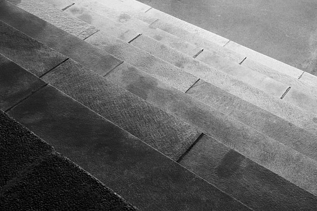

# Le binaire

Auteur : Franck CHAMBON

## I - Vocabulaire

### *Bit*

!!! info inline end "Le *bit*"
    L'informatique fonctionne avec **deux** états fondamentaux :

    - fermé  ou `0`, pas de signal
    - ouvert ou `1`, du signal
    
    **binaire** est l'adjectif pour deux états.


    |Nb états| Adjectif |
    |--------|----------|
    | 2  | Binaire      |
    | 3  | Ternaire     |
    | 8  | Octal        |
    | 10 | Décimal      |
    | 16 | Hexadécimal  |

    ---

    Le fonctionnement d'un ordinateur repose sur des
     [circuits de calcul logique et bit à bit]
     (https://fr.wikibooks.org/wiki/Fonctionnement_d%27un_ordinateur/Les_circuits_de_calcul_logique_et_bit_%C3%A0_bit?uselang=fr).
    

!!! tip "Le stockage d'information"
    L'unité élémentaire de stockage informatique
     au niveau le plus bas est le *bit* (_**Bi**nary digi**t**_).

    - Un disque dur contient des milliers de milliards de bits,
    - la mémoire vive contient des milliards de bits,
    - un processeur moderne d'architecture
     [`ARMv8`](https://fr.wikipedia.org/wiki/ARMv8) ou
     [`AMD64`](https://fr.wikipedia.org/wiki/AMD64),
     contient de la mémoire cache avec des millions de bits et
     des registres de 64 bits.

    Bref, l'information est constituée de cases remplies soit de `0`, soit de `1`.

!!! danger "Propriété mathématique"
    Avec un paquet de $n$ cases binaires, on peut coder $2^n$ symboles différents.

    !!! example "Avec 3 cases binaires"
        On peut coder $2^3 = 8$ symboles différents.

        - `000` pour 0
        - `001` pour 1
        - `010` pour 2
        - `011` pour 3
        - `100` pour 4
        - `101` pour 5
        - `110` pour 6
        - `111` pour 7

    !!! example "Avec 8 cases binaires"
        On peut coder $2^8 = 256$ symboles différents.

        Pour un lot de 8 bits, on parle d'**octet** (*byte*).

!!! info "Remarques"
    - *bit* est abrégé en $\text{b}$, comme dans un débit Internet
     à $24~\text{Mbps}$ (24 mégabits par seconde).
    - *byte* (prononcé « baïte ») est abrégé en $\text{B}$,
     le débit précédent correspond à $3~\text{MBps}$ (*3 megabytes per second*).
    - octet est abrégé en $\text{o}$,
     comme dans $3~\text{Mo}/\text{s}$, (3 mégaoctets par seconde).

??? example "Le débit de transmission - échelle logarithmique"
    [=25% "ADSL : $1$ à $15~\text{Mbps}$"]
    [=40% "3G+ : $40~\text{Mbps}$"]
    [=43% "VDSL : $50~\text{Mbps}$"]
    [=50% "4G : $100~\text{Mbps}$"]
    [=70% "Fibre : $500~\text{Mbps}$"]
    [=100% "5G : $10~\text{Gbps}$"]

### Octet

!!! info inline end "Transport de texte"
    En pratique les données informatiques transitent
     très souvent par paquets de 8 bits, donc par octets.

    La première raison à cela a été l'utilisation de l'ASCII
     pour transporter l'information du texte écrit.

    | Caractère | Code ASCII |
    |:---------:|:----------:|
    | `0` | `00110000` |
    | `1` | `00110001` |
    | `9` | `00111001` |
    | `A` | `01000001` |
    | `B` | `01000010` |
    | `Z` | `01011010` |
    | `a` | `01100001` |
    | `b` | `01100010` |
    | `z` | `01111010` |

!!! cite "ASCII"
    Le [codage ASCII](https://fr.wikipedia.org/wiki/American_Standard_Code_for_Information_Interchange)
     utilise un octet :

    - Le premier bit est à 0 ;
    - les 7 autres sont variables, donc $2^7 = 128$ symboles différents.

    Il est utilisé pour coder :

    - l'espace,
    - les chiffres arabes,
    - les lettres latines majuscules et minuscules sans accent,
    - des symboles de ponctuation,
    - des opérateurs mathématiques
    - et quelques autres symboles techniques.

    !!! warning "Limitations"
        ASCII ne peut pas coder tous les caractères.

        - Il existe trop de langues et donc énormément de lettres,
         un choix a été fait, des lettres latines.
        - Pour la ponctuation, un choix a aussi été fait.
        
        Pour un texte en anglais, avec une ponctuation classique,
         l'ASCII est parfaitement adapté.

??? danger "ASCII étendu"
    À une époque, dans certains pays, on utilisait
     une variante de l'ASCII étendu (un pour chaque pays),
     avec 128 symboles supplémentaires (ceux avec le bit de poids fort égal à 1).
    
    Le problème était pour la communication entre utilisateurs
     de différents pays ; c'était parfois compliqué...
     En France on utilisait l'[encodage](https://fr.wikipedia.org/wiki/ISO/CEI_8859-1)
     `latin-1` nommé aussi `ISO 8859-1`.

{{ basthon('scripts/convertisseur.py', 700) }}

!!! tip "Conversion de message"
    Avec le script ci-dessus, vous pouvez convertir un message texte ASCII vers du binaire.

    Un message peut alors être transmis par une communication électronique.

!!! done "UTF-8"
    Aujourd'hui on utilise souvent un codage
     [UTF-8](https://fr.wikipedia.org/wiki/UTF-8)
     avec un nombre variable d'octets pour pouvoir
     échanger du texte dans n’importe quelle langue, avec *smiley*...

    - Si le bit de poids fort est à `0`, alors le caractère est codé en ASCII ;
     le cas le plus fréquent.
    - Sinon, et c'est rare, il est codé sur plusieurs octets,
     et on peut utiliser au choix, tous les caractères
     que l'humanité est capable d'inventer :
     lettre de toute langue, hiéroglyphe, smiley, symbole technique, ...

!!! note "À retenir"
    Le poids d'un fichier texte est donné par la règle simplifiée :

    - Pour un texte très simple, un caractère pèse un octet.
    - Pour un texte plus technique, seuls les caractères hors ASCII sont
     codés sur plusieurs octets, et le poids en octets est supérieur
      au nombre de caractères. **Souvent juste un peu plus.**

    Exemple
    : Un livre simple en anglais d'un million de
     caractères pèse un méga-octet ($1~\text{Mo}$).

!!! tip "Niveaux de gris"
    [{align=right width=400}](https://commons.wikimedia.org/wiki/File:Nine_steps_stair_in_Lysekil_-_bw.jpg#/media/File:Nine_steps_stair_in_Lysekil_-_bw.jpg)

    Une autre utilisation de l'octet est de proposer 256 symboles différents,
     comme 256 nombres différents.
     **Un octet peut représenter un niveau de gris parmi 256.**

    Une image simple (en 256 niveaux de gris) est une liste de lignes,
     où chaque ligne est une liste de pixels codés sur **un** octet.
    
    !!! example "Exemple"
        Dans le cas d'une image de 640 pixels de large, par 426 pixels de haut,
         hors compression, le poids est de $640×426×1 \approx 270~\text{ko}$.

!!! faq "Et la suite ?"
    Pour coder d'autres nombres, pour des images plus précises,
     ou pour d'autres usages, on pourra utiliser plus que 8 bits.

## II - Codage des entiers

### Les entiers non signés sur 4 bits

!!! tip "À connaître"
    On a $2^4 = 16$ nombres de $0$ à $15$.

    | $n$ | binaire | hexadécimal |
    |:---:|---------|:-----------:|
    |$0$|`0000`|`0`|
    |$1$|`0001`|`1`|
    |$2$|`0010`|`2`|
    |$3$|`0011`|`3`|
    |$4$|`0100`|`4`|
    |$5$|`0101`|`5`|
    |$6$|`0110`|`6`|
    |$7$|`0111`|`7`|
    |$8$|`1000`|`8`|
    |$9$|`1001`|`9`|
    |$10$|`1010`|`A`|
    |$11$|`1011`|`B`|
    |$12$|`1100`|`C`|
    |$13$|`1101`|`D`|
    |$14$|`1110`|`E`|
    |$15$|`1111`|`F`|

    Ce tableau est à connaître et à savoir refaire !

    Il est très utile.

### Les entiers non signés sur 8 bits (1 octet)

!!! tip "À connaître"
    Il y a $2^8 = 256$ nombres de $0$ à $255$.

    Par exemple :

    | $n$ | binaire | hexadécimal |
    |:---:|---------|:-----------:|
    | $0$   |`0000 0000`|`0`|
    | $255$ |`1111 1111`|`FF`|
    | $15$  |`0000 1111`|`0F`|

    On note aussi :

    - $0 = (0000\,0000)_2$
    - $255 = (1111\,1111)_2$
    - $15 = (0000\,1111)_2$

On apprendra à faire les conversions, du binaire vers le décimal.

### Les entiers non signés sur 32 bits (4 octets)

Il y a $2^{32} = 4\,294\,967\,296$ nombres de $0$ jusqu'à $4\,294\,967\,295$.

!!! tip "À connaître"
    On retiendra que sur 4 octets, on peut différencier plus de 4 milliards de nombres.

## III - Opérations en binaire

### Conversion du décimal vers le binaire

#### Première technique

1. On divise le nombre par deux jusqu'à obtenir un quotient égal à zéro.
2. On lit les restes dans l'ordre inverse.

!!! example "Exemple : avec $53$"
    !!! info inline end "Lecture du résultat"
        Penser à lire du bas vers le haut.

    $$
    \begin{array}{rcl}
    53/2 = 26 & \text{et il reste} & 1\\
    26/2 = 13 & \text{et il reste} & 0\\
    13/2 = 6  & \text{et il reste} & 1\\
    6/2 = 3   & \text{et il reste} & 0\\
    3/2 = 1   & \text{et il reste} & 1\\
    1/2 = 0   & \text{et il reste} & 1\\
    \end{array}
    $$

    Le résultat est $53 = (11\,0101)_2$.

    On préférera compléter à gauche avec deux zéros pour faire des paquets de quatre bits.
    
    $53 = (0011\,0101)_2$

!!! note "Exercice"
    Donner la représentation binaire de $42$.

    ??? done "Solution"
        !!! info inline end "Lecture du résultat"
            Penser à lire du bas vers le haut.

        $$
        \begin{array}{rcl}
        42/2 = 21 & \text{et il reste} & 0\\
        21/2 = 10 & \text{et il reste} & 1\\
        10/2 = 5 & \text{et il reste} & 0\\
        5/2 = 2 & \text{et il reste} & 1\\
        2/2 = 1 & \text{et il reste} & 0\\
        1/2 = 0 & \text{et il reste} & 1\\
        \end{array}
        $$

        Le résultat est $42 = (10\,1010)_2$.

        On préférera compléter à gauche avec deux zéros pour faire des paquets de quatre bits.
        
        $42 = (0010\,1010)_2$

#### Deuxième technique

1. On cherche à écrire le nombre comme une somme de puissance de deux, la plus grande possible.
2. Les puissances obtenues donnent des `1` à l'écriture binaire,
 les puissances absentes donnent des `0` à l'écriture.

!!! example "Exemple : avec $53$"
    - $53 = 32 + 21$
    - $53 = 32 + 16 + 5$
    - $53 = 32 + 16 + 4 + 1$
    
    Il n'y a pas de $8$, ni de $2$
    
    - $53 = 1×32 + 1×16 + 0×8 + 1×4 + 0×2 + 1×1$
    - $53 = (11\,0101)_2$

!!! note "Exercice"
    Donner la représentation binaire de $42$.

    ??? done "Solution"
        - $42 = 32 + 10$
        - $42 = 32 + 8 + 2$
        
        Il n'y a pas de $16$, ni de $4$, ni de $1$
        
        - $42 = 1×32 + 0×16 + 1×8 + 0×4 + 1×2 + 0×1$
        - $42 = (10\,1010)_2$

!!! note "Exercice"
    1. Vérifier que $203 = (1100\,1011)_2$
    2. Vérifier que $204 = (1100\,1100)_2$
    3. Comment peut-on déduire l'écriture de $205$, de $206$ ?

### Ajouter un à une écriture binaire

!!! tip "Un algorithme"
    - On va faire une boucle sur les chiffres lus,
        - soit on lit `1`,
        - soit on lit `0`,
        - soit on sort dans le vide...

    1. On part du chiffre le plus à droite.
    2. Tant que le chiffre lu est égal à `1`,
        + on le change en `0`,
        + on se décale à gauche.
    3. Si on arrive dans le vide,
        + alors on écrit `1`.
        + sinon on change le `0` en `1`.

### Conversion binaire vers décimal

Chaque chiffre binaire correspond à une puissance de deux.

- `1` : la puissance est présente, elle compte $1$ fois.
- `0` : la puissance est absente, elle compte $0$ fois.

On lit les chiffres de la droite vers la gauche,
 cela donne les puissances de $2$ : $2^0 = 1$, puis $2^1 = 2$, puis $2^2 = 4$, etc.

!!! example "Exemple"
    On lit bien les chiffres de la **droite vers la gauche** !

    - $(1100\,1011)_2 = 1×1 + 1×2 + 0×4 + 1×8 + 0×16 + 0×32 + 1×64 + 1×128$
    - $(1100\,1011)_2 = 1×1 + 1×2 + 1×8 + 64 + 128$
    - $(1100\,1011)_2 = 203$

## Addition d’entiers non signés

!!! tip "Méthode"
    - On rappelle que $2 = (10)_2$, $3 = (11)_2$.
    - Il suffit de poser l’addition comme en primaire, avec les retenues.

!!! example "Exemple : avec $5+7 = 12$"
    - $5 = (101)_2$
    - $7 = (111)_2$
    - $12 = (1100)_2$

    ```
    retenues :  1 1 1
    -----------
                1 0 1
                + 1 1 1
                -------
                1 1 0 0
    ```

!!! note "Exercice"
    1. Vérifier en binaire que $179+75=254$.
    2. Vérifier en binaire que $13+13+13+13 = 13×4 = 52$.

!!! faq "La suite"
    Et si on essayait de poser aussi les multiplications en binaire ?

### Multiplication d’entiers non signés

!!! tip "Méthode"
    On pose la multiplication comme en primaire.

!!! example "Exemple : avec $13×11=143$"
    - $13 = (1101)_2$
    - $11 = (1011)_2$
    - $143 = (1000\,1111)_2$

    ```
    retenues : 1 1 1 1 0 0 0
    -----------
                    1 1 0 1
                    × 1 0 1 1
                    ---------
                    1 1 0 1
                    1 1 0 1 .
                        0 . .
                1 1 0 1 . . .
                =============
            1 0 0 0 1 1 1 1
    ```

## IV - Conteneurs standards pour les entiers

### Sur 8 bits (1 octet)

On a $2^8=256$ possibilités.

- Entiers non signés : de $0$ à $255$.
- Entiers signés : de $-128$ à $+127$.

> Pour les entiers signés on partage l'intervalle en deux,
 zéro étant à la fois positif et négatif, il reste une place,
 on choisit d'avoir un négatif de plus. Nous y reviendrons.

### Sur 32 bits (4 octets)

On a $2^{32} \simeq 4$ milliards de possibilités.

- Entiers non signés : de $0$ à $2^{32} -1$.
- Entiers signés : de $-2^{31}$ à $+2^{31}-1$.

### Codage des entiers signés

#### La mauvaise méthode : un bit de signe

1. On garde le bit de poids fort pour indiquer le signe.
2. Les autres bits indiquent la valeur numérique.

Il y a deux problèmes :

- Il y aurait deux représentations pour l'entier $0$ : $+0$ et $-0$.
- Les méthodes pour faire les opérations arithmétiques seraient complexes à programmer.

#### La bonne méthode : le complément à deux

##### La bonne nouvelle

Cette méthode résout les deux problèmes précédents :

- Il n'y a qu'une représentation pour $0$.
- Les circuits intégrés pour faire les opérations
 entre nombres signés et non signés **sont exactement les mêmes**.

##### Aperçu de la méthode

On voudrait $(+1) + (-1) = 0$

Sur un conteneur 8-bit, on prépare l'addition à trou,
 et on déduit que $(-1)$ se code avec `1111 1111`.

```
    0 0 0 0   0 0 0 1
  + 1 1 1 1   1 1 1 1
   ------------------
  1 0 0 0 0   0 0 0 0 
```

On remarque qu'il reste un bit de poids fort,
 mais il n'est plus dans le conteneur 8-bit ;
 il est perdu, et on obtient bien 0 !

On voudrait aussi $(+6) + (-6) = 0$

```
    0 0 0 0   0 1 1 0
  + 1 1 1 1   1 0 1 0
   ------------------
  1 0 0 0 0   0 0 0 0 
```

Comment obtenir plus rapidement l'opposé d'un entier ?

##### Obtenir le complément à deux

1. On part de l'écriture binaire de la partie numérique.
2. On inverse tous les bits $0↔1$.
3. On ajoute $1$.

!!! example "Exemple : avec $6=(0000\,0110)_2$"
    - L'inversion donne `1111 1001`
    - L'ajout de $1$ donne `1111 1010`

!!! note "Exercices"
    1. Quel est le complément à 2 sur 8 bits de $-105$ ?
    2. Quel est l'entier représenté en complément à deux sur 8 bits par `1100 1001` ?
    3. Quel est l'entier représenté en complément à deux sur 8 bits par `0000 1101` ?

    ??? done "Solution"
        1. On applique la méthode
            - $105 = (0110\,1001)_2$
            - L'inversion donne `1001 0110`.
            - L'ajout de $1$ donne `1001 0111`.
            - La réponse est `1001 0111`.

        2. On teste d'abord si le nombre est positif ou négatif.
            - Le bit de poids fort est à `1`, donc ce nombre est négatif ; on applique la méthode.
            - L'inversion donne `0011 0110`.
            - L'ajout de $1$ donne `0011 0111`
            - Ce nombre correspond à une partie numérique $1+2+4+16+32 = 55$.
            - Le nombre de départ était $-55$.

        3. On teste d'abord si le nombre est positif ou négatif.
            - Le bit de poids fort est à `0`, donc ce nombre est positif ;
             il suffit de lire sa partie numérique.
            - La partie numérique est $1+4+8 = 13$
            - Le nombre de départ était $+13$.

---

> Nous reviendrons sur ce chapitre pour travailler sur les conversions
 de bases entre binaire, octal et hexadécimal.
