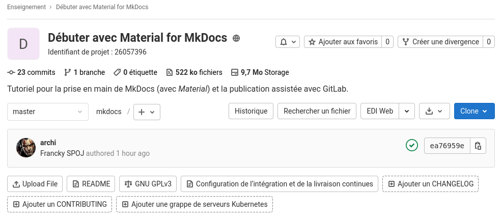
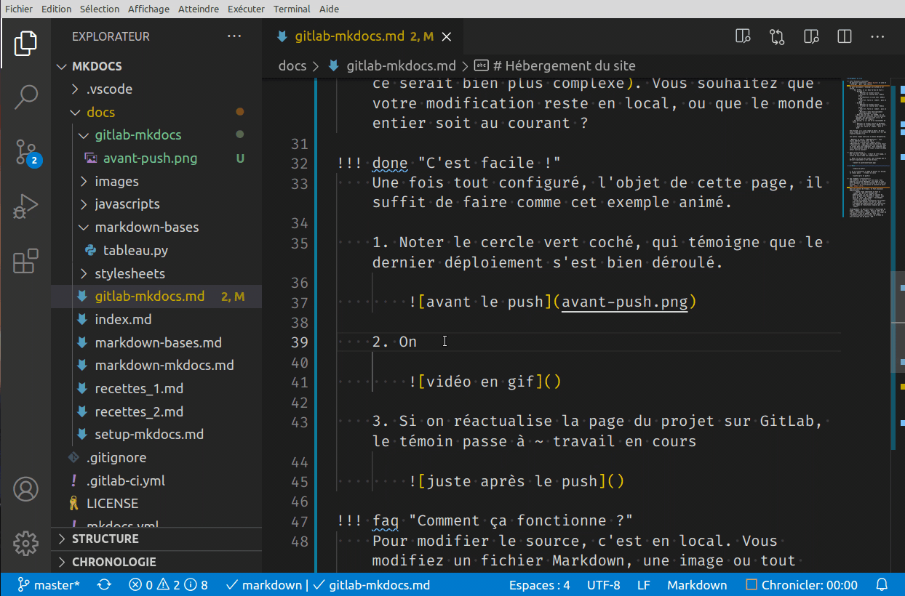
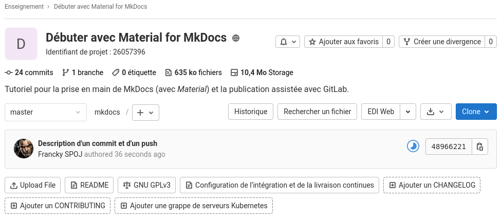

# Hébergement du site

:warning: page encore en brouillon. Merci de signaler toute aide complémentaire qui pourrait être apportée.

## Le choix de GitLab

!!! info "Plusieurs solutions"
    On pourrait construire (`mkdocs build`) le site et l'héberger à part ; pas facile.

    On peut facilement l'héberger sur GitHub ou sur GitLab.

    - Sur GitHub, il y a deux façons de faire :

        === "Méthode 1"
            - Modifier un fichier source.
            - Vérifier le résultat avec `mkdocs serve`.
            - Re-construire le site avec `mkdocs build`.
            - Avec Git, faire un `commit`, puis un `push`.
        
        === "Méthode 2"
            - Modifier un fichier source.
            - Vérifier le résultat avec `mkdocs serve`.
            - Avec Git, faire un `commit`, puis un `push`.
            - Utiliser l'outil de déploiement `mkdocs gh-deploy --force`
        
        Dans tous les cas, sur GitHub, il y a des risques de confusion avec une branche `gh-pages` qui pourrait être créée. On compte aussi **4 étapes**.

    - Sur GitLab, il y a une façon raisonnable de faire :

        === "Méthode automatique"
            - Modifier un fichier source en Markdown.
            - Vérifier le résultat avec `mkdocs serve`.
            - Avec Git, faire un `commit`, puis un `push`.
            - Le déploiement est alors automatique. :sunglasses:

        Avec GitLab, il y a une étape en moins, de plus aucun risque de confusion de branche, il n'y a pas d'autre branche créée.

!!! example "Étapes obligatoires"
    Ces trois étapes sont plus ou moins obligatoires.

    1. Modifier la source. **Obligatoire** : vous voulez modifier votre site, non ?
    2. Vérifier le résultat avec `mkdocs serve`. **Facultatif** : vous êtes certain de votre coup ?
    3. Utiliser Git. **Obligatoire** (en vrai non, mais ce serait bien plus complexe). Vous souhaitez que votre modification reste en local, ou que le document soit accessible sur le web ?

!!! done "C'est facile !"
    Une fois tout configuré, l'objet de cette page, il suffit de faire comme cet exemple animé.

    1. Noter le cercle vert coché, qui témoigne que le dernier déploiement s'est bien déroulé.

        

    2. On modifie le site.

        

    3. Si on réactualise la page du projet sur GitLab, le témoin passe à `pipeline: en cours`

        

    4. Après quelques secondes, (ou minutes) 
        - Si un problème survient (mauvaise configuration),
            - vous recevez un mail sur l'échec, le cercle contient une croix rouge.
            - Vous recevrez un mail pour chaque nouveau `push` jusqu'au succès inclus.
        - Si le cercle passe au vert, le site est déployé silencieusement, et on continue le travail.
    
    5. L'animation montrait
        - une modification d'un code source (celui-ci même).
        - Un `commit` grâce à l'outil graphique de VSCodium (en haut à gauche).
        - Un `push`, toujours avec VSCodium.
        - Cela peut aussi se faire avec d'autres éditeurs, ou en ligne de commande...
        - Il est totalement inutile d'aller voir sur GitLab le déroulé des opérations.
        - On peut continuer le travail de modification.
        - À chaque `push` le site sera automatiquement à jour en quelques instants.

!!! abstract "Comment cela fonctionne-t-il ?"
    Pour modifier le source, c'est en local. Vous modifiez un fichier Markdown, une image ou tout autre document. Les autres sections de ce tutoriel servent à ça. La vérification va souvent de pair avec `mkdocs serve`.

    Dans une journée de travail, on fait plusieurs modifications.

    - À chaque étape importante on fait un `commit` qui décrit l'ensemble des modifications, un peu comme un journal de bord. On peut faire plusieurs `commit` sans faire de `push`. Un `commit` s'accompagne toujours d'un commentaire.
    - Lorsqu'on souhaite synchroniser son travail avec le dépôt distant, on fait un `push`. L'ensemble des modifications est envoyé avec les étapes de transitions évoquées par les `commit`.
    
    Techniquement, on pourrait revoir l'historique du dépôt `commit` par `commit`. Dans le cadre d'un travail collaboratif, chaque `commit` est signé de son auteur. C'est au moment du `push` que l'authentification est vérifiée, du local vers le dépôt. La méthode la plus efficace est d'utiliser le protocole `SSH`.

!!! faq "De quoi a-t-on besoin ?"
    - D'un compte sur [GitLab](https://gitlab.com/). On supposera que c'est déjà le cas.
    - D'une clé d'authentification SSH. On expliquera comment.

## Un bon éditeur minimaliste

Si vous n'avez pas d'éditeur de texte minimaliste, c'est le moment.

!!! tip "Conseil"
    Choisir [micro](https://micro-editor.github.io/)

    === "Android"
        Dans un terminal

        ```console
        $ pkg install micro
        ```

    === "Linux"
        Dans un terminal

        ```console
        $ sudo apt install micro xclip
        ```

    === "Mac"
        Avec Homebrew

        ```console
        $ brew install micro
        ```

        Consulter la [note](https://github.com/zyedidia/micro#macos-terminal) qui conseille d'utiliser un meilleur émulateur de terminal : [iTerm2](https://iterm2.com/)

    === "Windows"
        Avec les gestionnaires de paquet [Chocolatey](https://chocolatey.org/) ou [Scoop](https://github.com/lukesampson/scoop).

        === "Chocolatey"
            ```console
            $ choco install micro
            ```

        === "Scoop"
            ```console
            $ scoop install micro
            ```

## Configuration de git

Pour la première utilisation de `git`, il faut lui renseigner votre identité.

Vos `commit` seront signés avec.

Dans un terminal

- Indiquer votre nom et email et
- remplacer _éventuellement_ `micro` par votre éditeur préféré.

```console
$ git config --global user.name "John Doe"
$ git config --global user.email johndoe@example.com
$ git config --global core.editor micro
```


Voir : https://git-scm.com/book/fr/v2/D%C3%A9marrage-rapide-Param%C3%A9trage-%C3%A0-la-premi%C3%A8re-utilisation-de-Git


??? warning "Le cas de Windows"
    Sous Windows, si vous souhaitez utiliser un éditeur de texte différent, vous devez spécifier le chemin complet vers son fichier exécutable. Ce chemin dépend de l’installation de votre éditeur de texte.

    Dans le cas de Notepad++, un éditeur de texte populaire pour la programmation, vous souhaiterez peut-être utiliser la version 32-bit, car au moment d’écrire ces lignes, la version 64-bit ne supporte pas tous les plug-ins. Si vous êtes sur un Windows 32-bit, ou si vous avez un éditeur 64-bit sur un OS 64-bit, vous utiliserez une commande du type :

    $ git config --global core.editor "'C:/Program Files/Notepad++/notepad++.exe' -multiInst -notabbar -nosession -noPlugin"


## Authentification SSH

!!! tip "Choix du commentaire sur la clé"
    Pour la génération d'une clé, il est utile d'indiquer de quoi distinguer cette clé des autres qui seront utilisées pour un même projet. Préparer votre **commentaire de clé**.

    - Pour un projet personnel, vous pouvez indiquer votre prénom et l'appareil associé à la clé.
    - Pour un projet professionnel, indiquer votre email. Vous copierez votre clé sur vos autres appareils.

=== "Avec Android"

    Avec par exemple `Francky sur tablette` comme commentaire.

    !!! tip "Installation"
        Dans **Termux**, on lance les mises à jour et l'installation de `openssh`

        ```console
        $ apt update
        $ apt upgrade
        $ apt install openssh
        ```

    Passer à la création de la clé

    ```console
    $ ssh-keygen -t ed25519 -C "Francky sur tablette"
    Generating public/private ed25519 key pair.
    Enter file in which to save the key (/data/data/com.termux/files/home/.ssh/id_ed25519): 
    ```

    - Conserver le choix par défaut, sauf si vous voulez une nouvelle clé sur cette machine.

    - Choisir une _passphrase_, ou bien laisser vide pour éviter d'avoir à la retaper souvent.

    Ajouter la clé à l'agent SSH.

    ```console
    $ eval "$(ssh-agent -s)"
    Agent pid 22584
    $ ssh-add ~/.ssh/id_ed25519
    Identity added: /data/data/com.termux/files/home/.ssh/id_ed25519 (Francky sur tablette)
    ```

    !!! tip "Copier la clé **publique**"
        Penser à la complétion automatique avec la touche ++tab++

        Ne pas oublier le `.pub` à la fin, `pub` comme public.

        ```console
        $ cat ~/.ssh/id_ed25519.pub
        ```

        On peut alors laisser son doigt sur l'écran, et sélectionner de `ssh-ed...` jusqu'à la fin du commentaire de clé. On peut copier.

        On se rend sur GitLab (connecté à son compte), dans "Profil", puis "Clefs SSH" : <https://gitlab.com/-/profile/keys>

        On peut coller la clé publique à l'endroit idoine, on lui choisit un **Titre** qui sera public ; du même goût que le commentaire c'est bien.

=== "Avec Linux"

    Avec par exemple `Francky sur ordi fixe` comme commentaire.

    Dans un **terminal**, dans cet exemple, le login sera `francky` 

    ```console
    $ ssh-keygen -t ed25519 -C "Francky sur ordi fixe"
    Generating public/private ed25519 key pair.
    Enter file in which to save the key (/home/francky/.ssh/id_ed25519): 
    ```

    - Conserver le choix par défaut, sauf si vous voulez une nouvelle clé sur cette machine.

    - Choisir une _passphrase_, ou bien laisser vide pour éviter d'avoir à la retaper souvent.

    Ajouter la clé à l'agent SSH.

    ```console
    $ eval "$(ssh-agent -s)"
    Agent pid 59566
    $ ssh-add ~/.ssh/id_ed25519
    Identity added: /data/data/com.termux/files/home/.ssh/id_ed25519 (Francky sur tablette)
    ```

    !!! tip "Copier la clé publique"
        Penser à la complétion automatique avec la touche ++tab++

        Ne pas oublier le `.pub` à la fin, `pub` comme public.

        ```console
        $ micro ~/.ssh/id_ed25519.pub
        ```

        On peut alors tout sélectionner (au clavier ou à la souris) de `ssh-ed...` jusqu'à la fin du commentaire de clé.
        
        Avec `micro` les raccourcis clavier sont classiques : ++ctrl+a++ pour tout sélectionner et ++ctrl+c++ pour copier.

        On se rend sur GitLab (connecté à son compte), dans "Profil", puis "Clefs SSH" : <https://gitlab.com/-/profile/keys>

        On peut coller la clé publique à l'endroit idoine, on lui choisit un **Titre** qui sera public ; du même goût que le commentaire c'est bien.

=== "Avec Mac"

    Cela semble être presque comme Linux ???

=== "Avec Windows"

    Il semble qu'il faille utiliser `Git Bash` ??? Qu'est-ce ???

    Ensuite c'est pareil...

## Création de son projet sur GitLab

1. Dans GitLab, choisir `Create blank project`
2. Lui donner
    - un nom
    - un identifiant
    - une description
    - l'accès en public
    - et un `README.md` minimaliste.
3. Ensuite, lui donner une licence.
    - Vous pouvez choisir un modèle (_template_), et dans le menu déroulant, à la fin une licence populaire comme `GNU GPL V3.0`
4. À la racine de votre projet, il y a un menu déroulant `Clone`. **Copier** la section `Clone with SSH`.
5. Enfin ouvrir un terminal dans un dossier comme `/Documents`, vous pourrez le **coller après** `git clone` en collant votre sélection.

    ```console
    $ git clone git@gitlab.com:<votre super projet>
    ```

## Création de son site

Entrer dans le dossier qui contient le `README.md`, et au choix

- Créer un nouveau site avec MkDocs dans ce dossier.

- Déplacer un projet MkDocs que vous avez créé. Ne pas oublier les fichiers cachés.

Le fichier `mkdocs.yml` devra se trouver dans le même dossier que votre `README.md`.

## Mise en place de l'intégration continue

C'est là que la magie opère, nous allons ajouter un fichier pour automatiser l'intégration continue (CI).

Dans le même dossier que le fichier `mkdocs.yml`, ajouter un fichier `.gitlab-ci.yml` contenant

```yaml
image: python:latest
pages:
  stage: deploy
  only:
    - master
  script:
    - pip install mkdocs-material
    - mkdocs build --site-dir public
  artifacts:
    paths:
      - public
```

## Votre premier push

Toujours dans le même dossier que `mkdocs.yml`, créer un fichier `.gitignore` qui contient

```
site/
```

**Objectif** : nous n'avons pas besoin de créer notre site en local avec `mkdocs build`, et même si nous le créions, nous n'aurions pas besoin de suivre l'historique de cette production. Seul l'historique des sources est pertinente.

On peut alors utiliser VSCodium comme dans l'animation en haut de cette page pour faire des `commit` et `push`.

!!! tip "`git add` et `git commit`"
    Un commit n'est pas seulement un commentaire, il accompagne un choix de fichiers modifiés.

    - En général, on ajoute au `commit` l'ensemble des fichiers modifiés. Dans ce cas, on coche le gros signe ++plus++.
    - On peut aussi choisir un ensemble non vide de fichiers, en cochant les ++plus++ associés aux fichiers souhaités. Ou en les choisissant tous, puis ôtant certains.
    - Il est possible d'exclure le suivi de certains fichiers ou dossier. Le fichier `.gitignore` sert à ça. Par exemple, il n'est pas pertinent de suivre le dossier `site/` ni les dossiers `__pycache__`, entre autres documents non source.


!!! faq "`git fetch` ?"
    VSCodium vous propose de faire des `git fetch` régulièrement.

    Si vous travailler seul, depuis un seul poste, c'est inutile.

    Si vous travaillez à plusieurs, ou depuis plusieurs postes, c'est utile. **Oui**.

    `git fetch` permet de vérifier si le dépôt contient des mises à jour que vous n'auriez pas en local. Soit par ce qu'un collègue a travaillé, soit vous travaillez avec une autre machine qui n'a pas encore la dernière version de votre site.


Avec Android, il faut le faire dans le terminal ; nous le verrons plus tard...

## Et le résultat ?

Dans votre projet GitLab, il y a un menu

- :gear: `Paramètres`, puis `Pages`
- là se trouve l'adresse de votre site créé automatiquement.

## Cloner votre projet sur une autre machine

Vous souhaitez travailler sur un autre machine, il faut au choix

- Soit (plus simple) lui faire créer une nouvelle clé SSH et l'ajouter à GitLab ; même procédure que précédemment.
- Soit copier votre clé sur votre machine, et la configurer.
