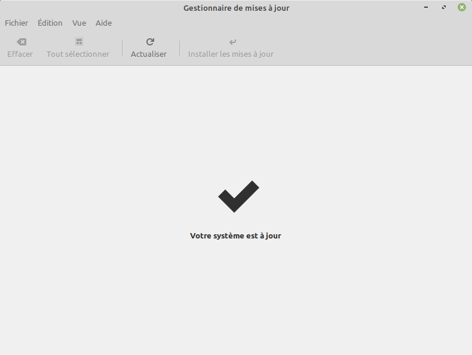
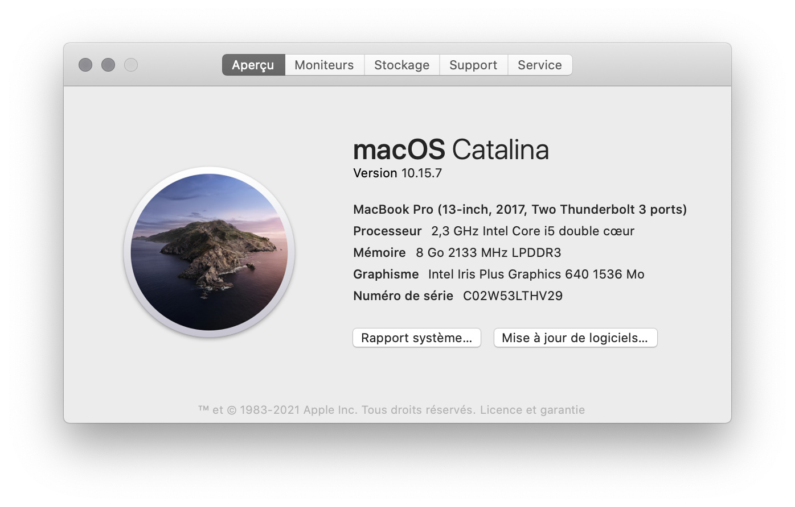

# Débuter avec MkDocs

Auteur : Franck CHAMBON

!!! tip "Objectifs"
    1. Introduction à Markdown pour son utilisation
        - avec [Jupyter](https://jupyter.org/), pour créer des carnets,
        - avec [CodiMD](https://apps.education.fr/), pour du travail collaboratif,
        - avec [MkDocs](https://www.mkdocs.org/), pour participer ou créer de la documentation comme celle-ci.
    2. Présentation des premiers pas pour héberger un site web statique avec [MkDocs for Material](https://squidfunk.github.io/mkdocs-material/), sur [GitLab](https://gitlab.com/) en particulier.

    À l'instar de cette page, il y a quelques éléments dynamiques et la construction est assez élémentaire pour être proposée
    
    - aux élèves en SNT, pour un travail en local,
    - aux élèves en NSI, pour la documentation de projet,
    - aux collègues enseignants pour du travail collaboratif.

!!! faq "Pourquoi MkDocs ?"
    [MkDocs](https://www.mkdocs.org/) permet de générer de la documentation autour de l'écosystème Markdown et Python.

    - C'est un logiciel libre reconnu pour sa qualité et très utilisé.  https://github.com/mkdocs/mkdocs/


## Prérequis

!!! note "Définitions"
    Par **machine**, on entend PC, smartphone ou tablette Android. On peut créer ou mettre à jour ce genre de site depuis n'importe quel type de machine qui a accès à Internet.

    Par **PC**, on entend un ordinateur avec un système d'exploitation Windows, Mac ou Linux.

    Pour **Linux**, on prendra l'exemple d'une distribution basée sur les paquets debian, sinon vous devriez savoir adapter ce qui suit sans difficulté.

!!! tip "Machine raisonnablement à jour"
    === "Android"
        ??? tip "Passer en mode développeur"
            - Accéder à `Paramètres` de l’appareil Android
            - Aller dans les paramètres `Système`
            - Aller dans ` À propos du téléphone `
            - Tapoter 7 fois ` Numéro de build `
            - C'est fait !

        !!! exemple "Mises à jour"
            1. Installer [F-Droid](https://www.f-droid.org/fr/).
            2. À partir de F-Droid, installer [Termux](https://termux.com/)
            4. Dans Termux, entrer
            ```console
            $ apt update
            $ apt upgrade
            $ apt install python
            $ pip install --upgrade pip
            ```
    === "Linux"
        ??? tip "Administration"
            {align=right width=400}
            Mettre à jour via une interface graphique, ou bien dans un terminal avec
            ``` console
            $ sudo apt update
            $ sudo apt upgrade
            $ sudo dpkg --configure -a
            ```

            !!! info "Gestionnaire de paquets Python"
                [pip](https://fr.wikipedia.org/wiki/Pip_(gestionnaire_de_paquets)) est le gestionnaire de paquets Python, suivant votre machine la commande est `pip` ou `pip3`.

                Dans la suite on la désignera par `pip`,
                
                - Si c'est `pip3` ; adapter.

            Vérifier (cf infra) la présente de `pip` ou `pip3`, et l'installer le cas échéant

            !!! tip "Installation de `pip`"
                ```console
                $ sudo apt install python3-pip
                ```
                **Redémarrer** alors, pour que le `PATH` inclut bien votre chemin de binaires, même si c'est probablement déjà le cas...


        !!! example "Mises à jour de `pip`"
            Dans un terminal entrer
            ```console
            $ sudo -H pip install --upgrade pip
            ```
    
    === "Mac"
        ??? tip "Administration"
            <!-- Merci @sebhoa pour la capture -->
            {align=right width=400}
            Mettre à jour le système via les `update` proposées.
        

            !!! info "Gestionnaire de paquets Python"
                [pip](https://fr.wikipedia.org/wiki/Pip_(gestionnaire_de_paquets)) est le gestionnaire de paquets Python, suivant votre machine la commande est `pip` ou `pip3`.

                Dans la suite on la désignera par `pip`,
                
                - Si c'est `pip3` ; adapter.

            Vérifier (cf infra) la présente de `pip` ou `pip3`, et l'installer le cas échéant

            !!! tip "Installation de `pip`"
                ```console
                $ sudo apt install python3-pip
                ```
                **Redémarrer** alors, pour que le `PATH` inclut bien votre chemin de binaires, même si c'est probablement déjà le cas...


        !!! example "Mises à jour de `pip`"
            Dans un terminal entrer
            ``` console
            $ pip install --upgrade pip
            ```

    === "Windows"
        ??? tip "Administration"
            Aucune idée... toute aide bienvenue
        
        !!! example "Mises à jour de `pip`"
            Dans un terminal entrer
            ``` console
            $ python -m pip install --upgrade pip
            ```

!!! done "Et Jupyter ?"
    On suppose que
    
    - vous avez déjà [Jupyter](https://jupyter.org/) installé, ou que
    - vous utilisez [Capytale](https://capytale2.ac-paris.fr/web/c-auth/list) avec des carnets [Basthon](https://basthon.fr/), ou que
    - vous utilisez [Try Jupyter](https://jupyter.org/try).


## Installation

!!! done "Vérification"
    Vérifier votre installation suivant votre machine avec

    === "python / pip"
        ```console
        $ python --version
        Python 3.8.5
        $ pip --version
        pip 21.0.1 from .../lib/python3.8/site-packages/pip (python 3.8)
        ```

    === "python3 / pip3"
        ```console
        $ python3 --version
        Python 3.8.5
        $ pip3 --version
        pip 21.0.1 from .../lib/python3.8/site-packages/pip (python 3.8)
        ```

    Si une erreur survient, contacter l'administrateur de la machine.

!!! tip "Material for MkDocs"
    Dans un terminal, avec `pip` ou `pip3` selon votre machine.

    === "python / pip"
        ```console
        $ pip install mkdocs-material
        ```

    === "python3 / pip3"
        ```console
        $ pip3 install mkdocs-material
        ```

    Cela installe automatiquement plusieurs paquets utiles.

## Créer un nouveau MkDocs

!!! tip "Votre expérience"
    Créer un dossier que vous pouvez nommer `experience1`, par exemple.

    Ouvrir un terminal dans ce dossier **vide**.

    ```console
    $ mkdocs new .
    ```

    `.` désigne le dossier courant.

!!! done "Vérification"
    Vous devriez avoir eu le message correspondant suivant

    <pre>
    INFO    -  Creating project directory: expérience
    INFO    -  Writing config file: experience1/mkdocs.ym
    INFO    -  Writing initial docs: experience1/docs/index.md
    </pre>

## Suivi en direct

!!! abstract "Au programme"
    Nous allons construire un site web, d'abord en local sur votre machine.

    On pourra le consulter depuis le navigateur Internet.

    À chaque modification d'un fichier, le site sera mis à jour.

!!! tip "Construction à la volée"
    Dans un terminal, toujours dans ce même dossier, entrer

    ```console
    $ mkdocs serve
    ```

    !!! done "Victoire ?"
        Vous aurez une sortie qui ressemble à 

        <pre>
        INFO    -  Building documentation... 
        INFO    -  Cleaning site directory 
        INFO    -  Documentation built in 0.07 seconds 
        <font color="#4E9A06">[I 210422 09:39:37 server:335]</font> Serving on <u>http://127.0.0.1:8000</u>
        INFO    -  Serving on <u>http://127.0.0.1:8000</u>
        <font color="#4E9A06">[I 210422 09:39:37 handlers:62]</font> Start watching changes
        INFO    -  Start watching changes
        </pre>

    !!! bug "Échec ?"
        Si vous avez une sortie qui ressemble à
        <pre>
        INFO    -  Building documentation... 

        Config file '...experience1/docs/mkdocs.yml' does not exist.
        </pre>
        C'est que vous avez lancé la commande dans le mauvais dossier.

!!! tip "Visionnage en direct"
    Ouvrir votre navigateur Web à l'adresse indiquée.

    **Astuce** : Mettre ce lien [http://127.0.0.1:8000/](http://127.0.0.1:8000/) dans les marque-pages ; vous y reviendrez souvent :wink:.

    Si vous avez un second écran, c'est le moment d'y placer cet onglet du navigateur :sunglasses:

    

!!! note "Modifions le site"
    Les fichiers dans le dossier ont pour l'instant cette architecture

    ```console
    .
    ├─ docs/
    │  └─ index.md
    └─ mkdocs.yml
    ```

!!! done "Victoire"
    Avec un bon éditeur de texte, éditer le fichier `docs/index.md`

    Voici ce qu'on peut faire.

    

    Avec pour résultat.

    

    À chaque fois qu'un fichier sera modifié et **enregistré**, le site sera mis à jour dans le navigateur.

    **Faîtes vos premières expériences !**

    **Vous pourrez bientôt créer votre site comme celui-ci !!!**

!!! info "Votre site n'est pas encore construit physiquement"
    Il est possible de construire physiquement (en local) votre site avec

    ```console
    $ mkdocs build
    ```

    C'est utile si vous avez une solution pour l'héberger ...

    Pour nous ce sera inutile, on déléguera le travail.
